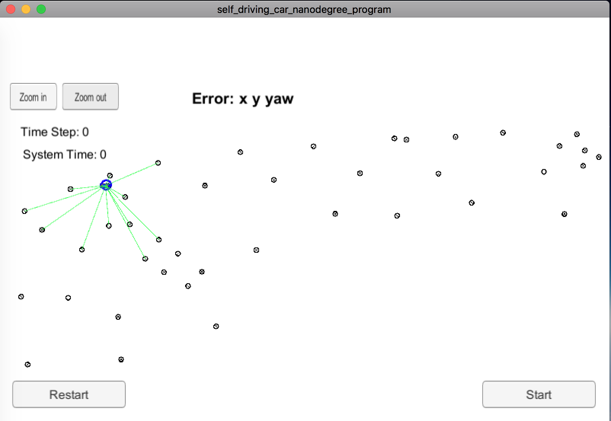
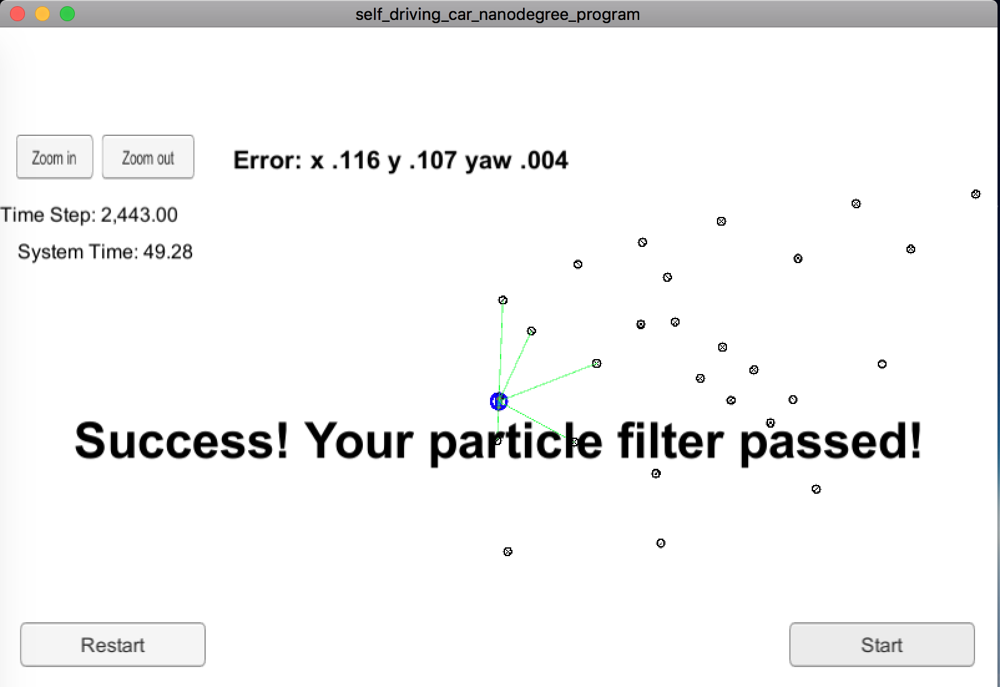
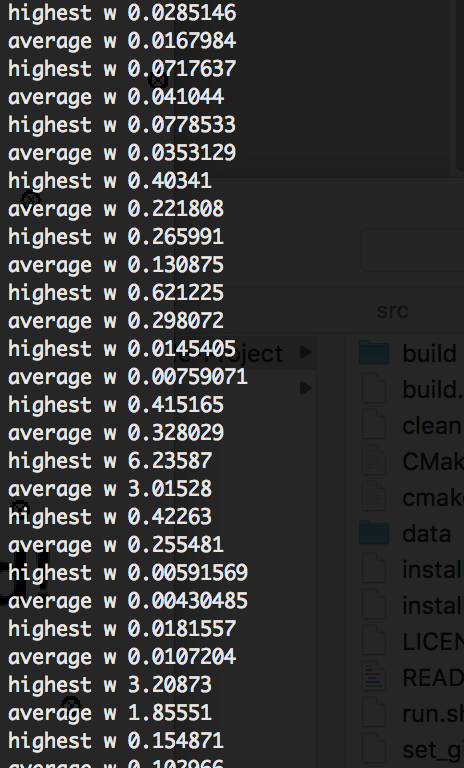

# Self-Driving Car Project 8. Kidnapped Vehicle

## Overview
This repository contains all the code needed to complete the project for the Localization course in the Self-Driving Car Project 8 Kidnapped Vehicle.

### Project Introduction
Our robot has been kidnapped and transported to a new location! Luckily it has a map of this location, a (noisy) GPS estimate of its initial location, and lots of (noisy) sensor and control data.

In this project we will implement a 2 dimensional particle filter in C++. Our particle filter will be given a map and some initial localization information (analogous to what a GPS would provide). At each time step our filter will also get observation and control data.

## Running the Code
This project involves the Kidnapped Vehicle Simulator which can be downloaded [here](https://github.com/udacity/self-driving-car-sim/releases)

This repository includes two files that can be used to set up and install uWebSocketIO for either Linux or Mac systems. For windows we can use either Docker, VMware, or even Windows 10 Bash on Ubuntu to install uWebSocketIO.

Once the install for uWebSocketIO is complete, the main program can be built and ran by doing the following from the project top directory.

1. `mkdir build`
2. `cd build`
3. `cmake ..`
4. `make`
5. `./particle_filter`

Alternatively some scripts have been included to streamline this process, these can be leveraged by executing the following in the top directory of the project:

1. `./clean.sh`
2. `./build.sh`
3. `./run.sh`

Tips for setting up our environment can be found [here](https://classroom.udacity.com/nanodegrees/nd013/parts/40f38239-66b6-46ec-ae68-03afd8a601c8/modules/0949fca6-b379-42af-a919-ee50aa304e6a/lessons/f758c44c-5e40-4e01-93b5-1a82aa4e044f/concepts/23d376c7-0195-4276-bdf0-e02f1f3c665d)

Note that the programs that need to be written to accomplish the project are `src/particle_filter.cpp`, and `particle_filter.h`.

Here is the main protocol that `main.cpp` uses for uWebSocketIO in communicating with the simulator.

**INPUT**: Values provided by the simulator to the c++ program
```
// Sense noisy position data from the simulator
["sense_x"]
["sense_y"]
["sense_theta"]

// Get the previous velocity and yaw rate to predict the particle's transitioned state
["previous_velocity"]
["previous_yawrate"]

// Receive noisy observation data from the simulator, in a respective list of x/y values
["sense_observations_x"]
["sense_observations_y"]
```

**OUTPUT**: Values provided by the c++ program to the simulator
```
// Best particle values used for calculating the error evaluation
["best_particle_x"]
["best_particle_y"]
["best_particle_theta"]

// Optional message data used for debugging particle's sensing and associations
// For respective (x,y) sensed positions ID label
["best_particle_associations"]

// For respective (x,y) sensed positions
["best_particle_sense_x"] <= list of sensed x positions
["best_particle_sense_y"] <= list of sensed y positions
```

Our job is to build out the methods in `particle_filter.cpp` until the simulator output says:

```
Success! Your particle filter passed!
```

## Particle Filter Impementation
The directory structure of this repository is as follows:

```
root
|   build.sh
|   clean.sh
|   CMakeLists.txt
|   README.md
|   run.sh
|
|___data
|   |   
|   |   map_data.txt
|   
|   
|___src
    |   helper_functions.h
    |   main.cpp
    |   map.h
    |   particle_filter.cpp
    |   particle_filter.h
```

The only file we should modify is `particle_filter.cpp` in the `src` directory. The file contains the scaffolding of a `ParticleFilter` class and some associated methods. We can read through the code, the comments, and the header file `particle_filter.h` to get a sense for what this code is expected to do.

If interested, we can take a look at `src/main.cpp` as well. This file contains the code that will actually be running our particle filter and calling the associated methods.

### Inputs to the Particle Filter
You can find the inputs to the particle filter in the `data` directory.

### The Map
The `map_data.txt` includes the position of landmarks (in meters) on an arbitrary Cartesian coordinate system. Each row has three columns
1. x position
2. y position
3. landmark ID

All other data the simulator provides, such as observations and controls.

> * Map data provided by 3D Mapping Solutions GmbH.

## Success Criteria
If our particle filter passes the current grading code in the simulator (we can make sure we have the current version at any time by doing a `git pull`), then we should pass!

The things the grading code is looking for are:
1. **Accuracy**: Our particle filter should localize vehicle position and yaw to within the values specified in the parameters `max_translation_error` and `max_yaw_error` in `src/main.cpp`.
2. **Performance**: Our particle filter should complete execution within the time of 100 seconds.

## Run the Particle Filter

Run the `./run.sh`, and here is the output:
```
Listening to port 4567
Connected!!!
```

Which means the our Particle Filter program has connected to the simulator successfully.

### The Start View of the Simulator



### Test Data and Accuracy

The simulator provides the test data and checks the accuracy.

### Test with the Simulator

Here is the final state of the simulator after running the Particle Filter:



Here is a snapshot on the log of the Particle Filter:



### The Implementation of the Particle Filter

The Particle Filter is implemented in [src/particle_filter.cpp](./src/particle_filter.cpp):
- Initialization: Particle initialization is implemented in [ParticleFilter::init](./src/particle_filter.cpp#L27) from line 27 to line 67.
- Prediction: The prediction step is implemented in [ParticleFilter::prediction](./src/particle_filter.cpp#L69) from line 69 to line 110.
- Updating Weights : This is an important operation in my opinion. It is implemented in [ParticleFilter::updateWeights](./src/particle_filter.cpp#L152) from line 152 to line 248.

The rest of the implementation are is mainly in [src/main.cpp](./src/main.cpp). The event handler declared at [line 56](./src/main.cpp#L56) parses the received message and call the above Particle Filter methods.
